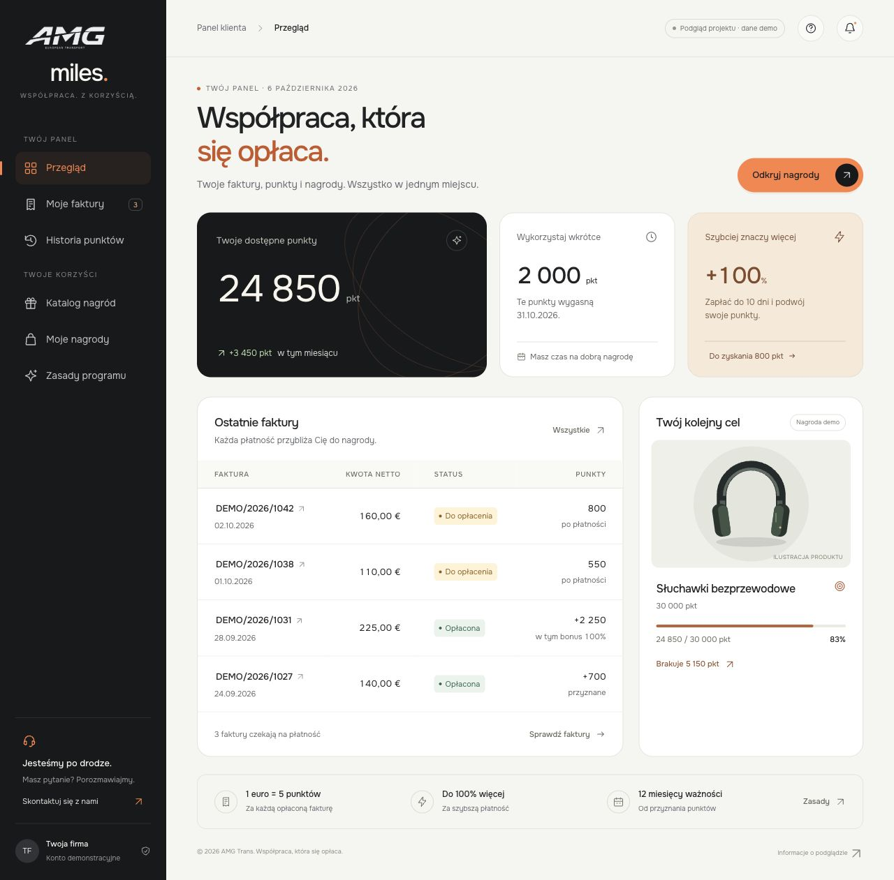
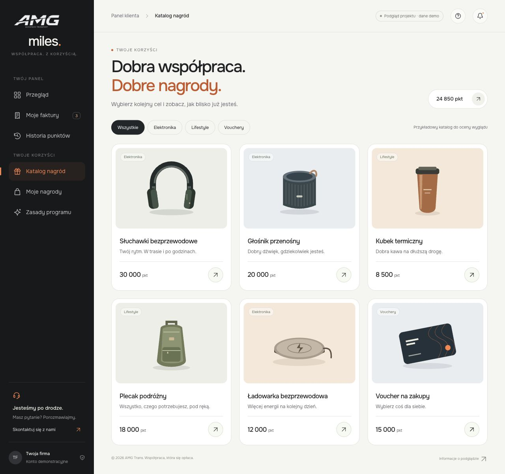

# AMG Miles — podgląd nowej identyfikacji

Klikalny projekt jasnego panelu AMG Miles, nawiązujący do identyfikacji AMG Trans.

**[Otwórz podgląd w przeglądarce](https://zuzanna-amg-trans.github.io/amg-miles-design-preview/)**

Projekt zawiera wyłącznie fikcyjne, oznaczone dane demonstracyjne. Jest koncepcją wizualną do oceny i dalszej pracy. Repozytorium nie zawiera backendu programu AMG Miles ani danych klientów.

## Dostępne widoki

- Przegląd punktów, faktur i wybranej nagrody.
- Moje faktury z filtrowaniem i wyszukiwaniem.
- Historia punktów.
- Katalog nagród z kategoriami i szczegółami.
- Moje nagrody: przykład stanu pustego.
- Zasady programu.

## Podglądy





## Testy i publikacja na GitHubie

Workflow [Test and publish preview](https://github.com/zuzanna-amg-trans/amg-miles-design-preview/actions/workflows/preview.yml) wykonuje pełne testy na maszynach GitHuba. Pull request uruchamia sprawdzenie składni i 22 testy przeglądarkowe w widoku komputerowym oraz mobilnym. Testowany jest gotowy pakiet strony, obejmujący sześć widoków, filtry, wyszukiwanie, okna szczegółów, wybór celu, FAQ, nawigację, ładowanie zasobów i brak przewijania całej strony w poziomie.

Po zmianie `main` ten sam workflow publikuje przetestowany pakiet przez GitHub Pages, odczytuje publiczny identyfikator commita i sumy kontrolne zasobów oraz ponownie wykonuje 22 testy na publicznej stronie. Nieudane testy przed publikacją blokują nowe wdrożenie. Źródłem Pages jest **GitHub Actions**.

Raporty poprawnych testów wygasają po **7 dniach**, diagnostyka błędów po **14 dniach**, a pakiet do publikacji po **1 dniu**. Wygaśnięcie pakietu nie usuwa opublikowanej strony. Screenshoty i ślady są zachowywane tylko przy błędzie; nagrywanie wideo jest wyłączone. Ważne materiały do nadal nierozwiązanego problemu trzeba zachować osobno przed ich wygaśnięciem.

Pełne testy i pakowanie strony mają blokadę uruchamiania poza GitHub Actions. Nie ma potrzeby instalowania testowych przeglądarek ani zależności npm na Macu. Raportów nie pobieramy automatycznie. Wyniki testów, cache zależności i pakiet `_site` są wykluczone z historii Git; istniejące cztery wybrane ilustracje w README pozostają stałymi materiałami dokumentacyjnymi.

## Opcjonalny podgląd lokalny

```sh
python3 design-preview/server.py
```

Otwórz `http://127.0.0.1:4318`.

Serwer jest opcjonalny; na co dzień korzystamy z opublikowanego podglądu. Zatrzymaj go klawiszami `Ctrl+C` po zakończeniu pracy. Kod i szczegóły prototypu znajdują się w [design-preview](design-preview/README.md).

## Zasoby

Logo AMG Trans pochodzi z oficjalnej strony AMG Trans. Nazwa i znak AMG pozostają własnością ich właściciela. Font Onest jest dystrybuowany na licencji [SIL Open Font License 1.1](design-preview/assets/OFL-Onest.txt). Ilustracje nagród są autorskimi wektorowymi placeholderami przygotowanymi do prezentacji wyglądu.
